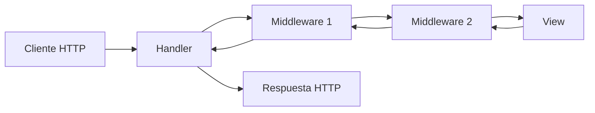
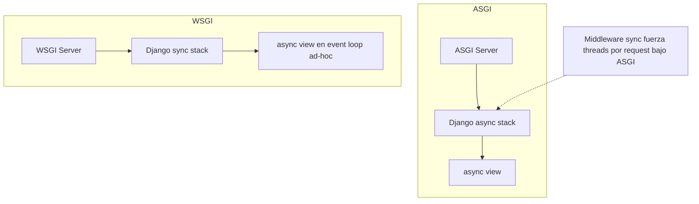

# Django 6.0 — Skill de conocimiento consolidado para Codex

## Resumen ejecutivo

Este archivo consolida, con foco operacional y reutilizable, los componentes principales de la documentación oficial de **Django 6.0** (tutoriales, guías temáticas, how-to, referencia de APIs, y notas de versión), priorizando superficies de API y patrones de implementación que suelen convertirse en “puntos de fricción” al generar código automatizado. La versión **Django 6.0** declara compatibilidad oficial con **Python 3.12, 3.13 y 3.14** (recomendando el micro-release más reciente de cada serie). citeturn15view0turn3search0

En cuanto a novedades de plataforma, Django 6.0 incorpora **soporte nativo de Content Security Policy (CSP)** (vía `ContentSecurityPolicyMiddleware`, settings `SECURE_CSP`/`SECURE_CSP_REPORT_ONLY`, constantes `django.utils.csp.CSP`, decoradores por vista y soporte de “nonce” con `django.template.context_processors.csp`). citeturn15view0turn12view0turn12view1turn12view2turn12view3 También incorpora **template partials** (tags `` / ``) y soporte de carga de fragmentos con sintaxis `template.html#partial_name` al usar el backend `DjangoTemplates`. citeturn16view0turn16view1turn15view0

Otra incorporación relevante es el **Tasks framework** (tareas en segundo plano): Django 6.0 provee definición, validación, encolado y gestión de resultados, pero **no** incluye el mecanismo/worker de ejecución; la ejecución debe resolverse con infraestructura externa y un backend apropiado configurado en `TASKS`. citeturn13view0turn0search0

En seguridad y mantenimiento, las **patch releases** 6.0.x documentan correcciones de vulnerabilidades y regresiones. Por ejemplo: (i) una corrección en `URLField.to_python()` para evitar normalización Unicode costosa en Windows (mitigación de DoS por “Unicode normalization”), y (ii) un DoS potencial por concatenación super-lineal al combinar headers repetidos bajo `ASGIRequest`, entre otras. citeturn15view1turn15view2

> Nota de alcance: “Django Channels” no es un componente núcleo descrito como parte del framework base en estas páginas; este skill se centra en el core de Django 6.0 y sus extensiones oficiales documentadas (incluyendo async/ASGI, pero sin asumir APIs de Channels).

## Índice navegable

- [Desarrollo analítico](#desarrollo-analítico)
  - [Compatibilidad con Python e instalación](#compatibilidad-con-python-e-instalación)
  - [Estructura de proyecto, settings y arranque](#estructura-de-proyecto-settings-y-arranque)
  - [Modelos, ORM y consultas](#modelos-orm-y-consultas)
  - [Migraciones y transacciones](#migraciones-y-transacciones)
  - [URLs, vistas y objetos request/response](#urls-vistas-y-objetos-requestresponse)
  - [Middleware](#middleware)
  - [Plantillas y template partials](#plantillas-y-template-partials)
  - [Forms y validación](#forms-y-validación)
  - [Asincronía y ASGI](#asincronía-y-asgi)
  - [Tasks framework](#tasks-framework)
  - [Caching](#caching)
  - [Logging](#logging)
  - [Admin y auth](#admin-y-auth)
  - [Seguridad y CSP](#seguridad-y-csp)
  - [Testing](#testing)
  - [Despliegue y checklist](#despliegue-y-checklist)
  - [Internacionalización](#internacionalización)
- [Skill para Codex](#skill-para-codex)
  - [Contrato operativo de la skill](#contrato-operativo-de-la-skill)
  - [Snippets listos para Codex](#snippets-listos-para-codex)
  - [Plantillas de prompts para Codex](#plantillas-de-prompts-para-codex)
  - [Diagramas mermaid](#diagramas-mermaid)
- [Conclusiones](#conclusiones)
- [Validación de cobertura](#validación-de-cobertura)
- [Contexto metodológico](#contexto-metodológico)
- [Bibliografía](#bibliografía)

## Desarrollo analítico

### Compatibilidad con Python e instalación

Django 6.0 soporta oficialmente **Python 3.12, 3.13 y 3.14**, recomendando el micro-release más reciente de cada serie; además, la rama 5.2.x es la última en soportar Python 3.10/3.11. citeturn15view0 La tabla canónica de compatibilidad “Django version ↔ Python versions” se encuentra en el FAQ de instalación, que además explicita que Django solo soporta oficialmente el **último micro release** de cada serie soportada. citeturn3search0

La instalación oficial se describe en la guía “How to install Django”, que encadena explícitamente prerequisitos (Python y BD) y remite al FAQ de compatibilidad de versiones. citeturn3search2turn3search0 En el tutorial inicial se reafirma que el tutorial está escrito para Django 6.0 (con Python 3.12+). citeturn3search4

**Recomendación operacional para Codex (no inventar):** si el usuario declara Python <3.12, el generador debe proponer (a) subir Python o (b) bajar a una rama compatible (p.ej. 5.2 LTS), y explicitar que esa decisión es externa al alcance 6.0. citeturn15view0turn3search0

---

### Estructura de proyecto, settings y arranque

El punto de arranque del framework y su “bootstrap” a nivel de aplicaciones está gobernado por `django.setup()`, que carga settings, configura logging, define el script prefix de URL resolver (según `FORCE_SCRIPT_NAME`) e inicializa el registry de aplicaciones. citeturn0search14turn26view0

La referencia de settings documenta opciones centrales (por categorías) y cambios relevantes para 6.0. Un ejemplo concreto: `ADMINS` en 6.0 acepta lista de strings en lugar de la forma histórica basada en tuplas `(name, address)` en versiones antiguas. citeturn0search2

La documentación también ofrece mecanismos para inspección/gestión desde CLI (`django-admin`, `manage.py`). Por ejemplo, `diffsettings` compara settings actuales vs defaults y documenta sus opciones (`--all`, `--default`, `--output`). citeturn0search36

---

### Modelos, ORM y consultas

La guía de modelos define opciones de campo frecuentes (`default`, `db_default`, `help_text`, `primary_key`, `unique`) y comportamientos asociados. Por ejemplo, `db_default` define un default computado en BD, y si coexiste con `Field.default`, **`default` tiene precedencia al crear instancias en Python**, mientras `db_default` permanece a nivel de base de datos (inserciones fuera del ORM o al añadir campos vía migración). citeturn17view0

La referencia de campos detalla semánticas críticas: `primary_key=True` implica `null=False` y `unique=True`, solo un campo por modelo puede declararse así, y para claves primarias compuestas debe usarse `CompositePrimaryKey`. citeturn17view3turn2search5 La misma referencia documenta que la clave primaria es “read-only” a nivel de semántica del ORM: cambiarla y guardar crea un nuevo objeto en vez de actualizar el existente (con ejemplo). citeturn17view0turn17view3

**Claves primarias compuestas (composite primary keys).** Django 6.0 integra esta capacidad (introducida en 5.2) mediante `models.CompositePrimaryKey(*field_names, **options)` como campo virtual, definido necesariamente como atributo `pk` del modelo. citeturn17view3turn2search8 La guía temática de claves primarias compuestas documenta limitaciones prácticas: al ser un campo virtual compuesto por múltiples expresiones, algunas funciones de BD no lo aceptan (p.ej. `Max("pk")` levanta `ValueError`, con excepción explícita para `Count("pk")`). También señala que no aparece como campo en `ModelForm` y detalla consideraciones de validación. citeturn2search2

**Consultas y QuerySets.** La documentación temática de “Making queries” y la referencia de `QuerySet` concentran patrones de filtrado, evaluación perezosa, y API de métodos. citeturn17view1turn17view2 En entornos asíncronos, Django declara que los métodos de `QuerySet` que disparan SQL tienen variante asíncrona con prefijo `a` y `async for` sobre QuerySets es soportado. citeturn14view0

---

### Migraciones y transacciones

**Migraciones.** Django define migraciones como el mecanismo para propagar cambios de modelos (añadir campo, borrar modelo, etc.) al esquema de BD. La documentación destaca el conjunto de comandos: `makemigrations` (crear), `migrate` (aplicar/revertir), `sqlmigrate` (SQL equivalente), `showmigrations` (estado). citeturn19view1turn18search8 Para librerías de terceros, se explicita que `makemigrations` debe ejecutarse con la menor versión de Django que se desea soportar; el sistema de migraciones mantiene compatibilidad ascendente conforme a la política general, pero **no promete compatibilidad descendente**. citeturn18search6

**Transacciones.** La guía de transacciones documenta que Django opera por defecto en **autocommit**, y describe dos modelos: (i) transacciones por request vía `ATOMIC_REQUESTS`, y (ii) control explícito con `transaction.atomic(using=None, savepoint=True, durable=False)`. citeturn19view0 Se advierte sobre el coste de abrir una transacción por request y se detalla el caso problemático de `StreamingHttpResponse` (generación posterior fuera de la transacción del view). citeturn19view0

Un punto altamente operacional es el patrón “acciones después del commit”: `transaction.on_commit(func, using=None, robust=False)` para ejecutar callbacks solo si la transacción más externa se confirma; si no hay transacción abierta, el callback se ejecuta inmediatamente. Además, `robust=True` permite continuar con callbacks posteriores, registrando excepciones en el logger `django.db.backends.base`. citeturn19view0

Este patrón se conecta directamente con Tasks framework: al encolar una tarea dentro de un `atomic()` existe riesgo de que un worker procese antes del commit; la documentación recomienda `transaction.on_commit()` con `functools.partial(my_task.enqueue, ...)`. citeturn13view0turn19view0

---

### URLs, vistas y objetos request/response

**URL dispatcher.** Django define que el URLconf compara contra la ruta solicitada (sin querystring, sin dominio), y que el ruteo no depende del método HTTP. La guía también discute defaults de parámetros, nombres de patrones para `reverse()`, y consideraciones de rendimiento por compilación y cache del resolvedor. citeturn21view1

**Vistas.** Una view (function-based) recibe un `HttpRequest` y devuelve un `HttpResponse`; se documentan ejemplos básicos, respuestas con status explícito, errores (`Http404`) y personalización de handlers `handler400/403/404/500`. citeturn21view0 También se integra el punto de extensión hacia asincronía: una vista puede ser `async def`, pero para rendimiento real se recomienda ASGI. citeturn21view0turn14view0

**Request/response objects.** La referencia de `HttpRequest`/`HttpResponse` incluye:
- Semántica de headers (acceso vía estructuras dict-like).
- Métodos como `get_signed_cookie(...)` (con ejemplos y excepciones como `BadSignature` / `SignatureExpired`).
- Soporte de negociación de contenido: `get_preferred_type(media_types)` (nuevo en 5.2) y `accepts(mime_type)`; y advertencia de cacheo cuando la respuesta varía por `Accept` (usar `vary_on_headers('Accept')`). citeturn22view0turn0search31
- `QueryDict` para manejar múltiples valores por clave (inmutabilidad en ciclo normal, `copy()` para versión mutable, `getlist()`, `setlist()`, etc.). citeturn22view0

---

### Middleware

Django define middleware como un sistema de “hooks” de bajo nivel para alterar globalmente el procesamiento request/response; se activa vía la lista `MIDDLEWARE` (paths Python) y su orden importa por dependencias (p.ej. autenticación depende de sesiones). citeturn21view2turn10search7

La guía explica el modelo de “capas” (onion): en request se ejecuta top-down, y en response en orden inverso. citeturn21view2turn20search5 También documenta:
- `MiddlewareNotUsed` para deshabilitar middleware en tiempo de inicialización. citeturn20search1turn0search22
- Compatibilidad sync/async declarada por flags (`sync_capable`, `async_capable`) y utilidades en `django.utils.decorators` para marcar middleware. citeturn21view2turn20search1turn14view0

---

### Plantillas y template partials

**Filosofía del lenguaje de plantillas.** La DTL está diseñada para separar presentación de lógica; no ejecuta expresiones arbitrarias de Python y se limita a tags/filters definidos (extensibles con librerías propias). También describe la mecánica de resolución con `.` (dictionary → attribute/method → numeric index; si callables, se invocan sin args). citeturn16view2

**Template partials (Django 6.0).**
- En la referencia de builtins se documentan los tags `partial` y `partialdef` como nuevos en 6.0, con ejemplos de definición y render repetido. citeturn16view0
- En la guía de templates (topic guide), se documenta que al usar backend `DjangoTemplates` se puede cargar un fragmento específico con `get_template("template.html#partial_name")`, y que el objeto retornado se comporta como `Template` pero incluye solo el contenido del partial. citeturn16view1
- La referencia de templates organiza explícitamente la sección “Template partials” dentro de la documentación del lenguaje, y la conecta con carga/inclusión. citeturn16view3turn16view0turn16view1

---

### Forms y validación

La guía “Working with forms” define:
- Diferencias semánticas y de seguridad entre `GET` y `POST` (p.ej. `POST` para cambios de estado; `GET` expone datos en URL y logs).
- Papel de Django en forms: preparar datos, renderizar HTML, recibir y limpiar/validar, con una arquitectura basada en `Form`, campos y widgets.
- Patrón de uso típico: `form = NameForm(request.POST)`, validación con `form.is_valid()`, y consumo de `form.cleaned_data`. citeturn23view0

Para forms basados en modelos, la documentación de `ModelForm` y (en general) formsets enfatiza la necesidad de renderizar el `management_form` y, cuando se renderiza manualmente, cuidar el campo PK si aplica (en el contexto del formset) para que el POST funcione correctamente. citeturn23view2turn10search9

---

### Asincronía y ASGI

Django 6.0 soporta vistas asíncronas y un stack request completamente async **solo bajo ASGI**; bajo WSGI las async views funcionan con penalización y sin eficiencia para long-running requests. citeturn14view0

Puntos operacionalmente críticos:
- Django detecta vistas async con `asgiref.sync.iscoroutinefunction`; si se usa un patrón custom debe marcarse con `asgiref.sync.markcoroutinefunction`. citeturn14view0
- **Beneficios de async**: se maximizan si no hay middleware sincrónico, de lo contrario Django debe usar un thread por request para emular entorno sync. citeturn14view0turn21view2
- ORM async: se admiten variantes `a*` de métodos que disparan SQL y `async for` sobre QuerySets; sin embargo, **transacciones aún no funcionan en modo async** y se recomienda encapsular la parte transaccional en una función sync y llamarla con `sync_to_async()`. citeturn14view0turn19view0
- Seguridad async: partes “async-unsafe” (con estado global no coroutine-aware) están protegidas, y llamar desde un thread con event loop levanta `SynchronousOnlyOperation`; `DJANGO_ALLOW_ASYNC_UNSAFE` existe pero se advierte que puede causar corrupción/loss si hay concurrencia. citeturn14view0
- La documentación recomienda deshabilitar conexiones persistentes (`CONN_MAX_AGE`) en modo async. citeturn14view0turn27view1

---

### Tasks framework

Django 6.0 introduce un framework de tareas para ejecutar trabajo fuera del ciclo request/response; define `Task`, `TaskResult`, encolado, validación y resultados, pero **no provee el worker** (mecanismo de ejecución), delegándolo en infraestructura externa. citeturn13view0turn0search0

Elementos documentados con alto impacto en generación de código:
- **Configuración:** setting `TASKS`, soporta múltiples backends. citeturn13view0
- **Backends integrados (solo dev/test):**
  - `ImmediateBackend`: ejecuta inmediatamente (default si no se especifica) y es útil para introducir tareas gradualmente o en tests. citeturn13view0
  - `DummyBackend`: no ejecuta tareas, mantiene resultados en `READY`, expone `results` y `clear()`. citeturn13view0
- **Definición:** decorator `@django.tasks.task` sobre función a nivel de módulo; retorna instancia `Task`. Puede parametrizarse (p.ej. `priority`, `queue_name`, `takes_context=True`) y recibir `TaskContext`. citeturn13view0
- **Encolado:** `Task.enqueue(...)` retorna `TaskResult`; existe variante async `aenqueue()`. Los argumentos y retornos se serializan a JSON: deben ser JSON-serializables y además “round-trip safe” (`json.dumps`/`json.loads` sin cambio de tipo). citeturn13view0
- **Transacciones:** para evitar que el worker lea datos no commiteados, usar `transaction.on_commit(partial(task.enqueue, ...))`. citeturn13view0turn19view0
- **Resultados:** recuperar por `id` (`Task.get_result(id)` o backend `default_task_backend.get_result(id)`); refrescar estado con `TaskResult.refresh()` (o `arefresh()`); algunos backends (p.ej. `ImmediateBackend`) no soportan `get_result()` y deben lanzar `NotImplementedError`. citeturn13view0

---

### Caching

El framework de cache soporta varios niveles de granularidad (sitio, vista, fragmentos, low-level API) y se configura vía setting `CACHES`. citeturn27view0 Ejemplo: Memcached es documentado como backend in-memory y Django soporta bindings `pylibmc` y `pymemcache`, con backends `django.core.cache.backends.memcached.PyLibMCCache` / `PyMemcacheCache` y `LOCATION` como `ip:port` o `unix:path`. citeturn27view0 También existe un “dummy cache” para entornos donde se quiere mantener interfaz sin cachear realmente. citeturn27view0

---

### Logging

La guía “How to configure and use logging” estructura logging como `LOGGING` (formato `dictConfig`) que extiende defaults, y enfatiza configuraciones mínimas: `version`, `disable_existing_loggers`, handlers y loggers. citeturn26view1

La referencia de logging documenta jerarquías y loggers relevantes (`django.request`, `django.server`, `django.template`, `django.db.backends`, `django.security.*`, etc.). Un detalle operativo clave: el logging de SQL (`django.db.backends`) solo se habilita cuando `settings.DEBUG=True` por razones de rendimiento. citeturn26view0turn0search6

---

### Admin y auth

**Admin.** La referencia de `django.contrib.admin` especifica requisitos mínimos: apps contrib necesarias en `INSTALLED_APPS`, backend `DjangoTemplates` con context processors requeridos (incluyendo `request`, auth y messages), y middleware mínimo (sessions/auth/messages). citeturn25view0 Se documenta registro de modelos vía `admin.site.register(...)` o decorador `@admin.register`. citeturn25view0 En `AdminSite` aparece un punto “New in Django 6.0”: `AdminSite.password_change_form` como subclass de `PasswordChangeForm` para la vista de cambio de contraseña del admin. citeturn25view0

**Auth.** En “Using the Django authentication system” se documenta:
- `login_required(...)` con parámetros como `redirect_field_name` y `login_url`, y su interacción con `settings.LOGIN_URL`.
- `LoginRequiredMixin` para CBVs.
- `login_not_required()` como mecanismo para permitir acceso anónimo cuando `LoginRequiredMiddleware` fuerza auth por defecto. citeturn24view0

---

### Seguridad y CSP

La guía “Security in Django” describe un mapa de amenazas y mitigaciones: sanitización de input, XSS (incluyendo limitaciones de escape en contextos peligrosos), CSRF (con verificación adicional via `Referer` bajo HTTPS en `CsrfViewMiddleware`), SQL injection (protección por query parameterization en QuerySets, cautela con raw SQL/`extra()`/`RawSQL`), clickjacking (X-Frame-Options middleware), y mejores prácticas para HTTPS y headers. citeturn10search0

**Content Security Policy (nuevo en Django 6.0).** Django 6.0 incorpora soporte oficial de CSP como estándar, con:
- `ContentSecurityPolicyMiddleware` y headers `Content-Security-Policy` / `Content-Security-Policy-Report-Only`. citeturn12view2turn12view0
- Settings `SECURE_CSP` y `SECURE_CSP_REPORT_ONLY` (políticas como diccionarios). citeturn12view0turn12view3
- Enum `django.utils.csp.CSP` con constantes (`SELF`, `NONE`, `UNSAFE_INLINE`, `NONCE`, etc.) y semántica explícita de `NONCE` como placeholder que el middleware reemplaza por nonce seguro por request. citeturn12view0turn11search10turn11search11
- Decoradores `csp_override(config)` y `csp_report_only_override(config)` que **reemplazan** la política para una vista y pueden desactivarla con `{}` (con advertencia de riesgo sistémico por “same origin”). citeturn12view0turn11search0
- Soporte de nonce en templates vía context processor `django.template.context_processors.csp`, exponiendo `csp_nonce`, con advertencias fuertes respecto a cacheo de respuestas con nonce (el nonce debe ser único por request; no cachear páginas completas que lo incluyan). citeturn12view0turn12view1

**Notas de seguridad 6.0.x (ejemplos de cambios con impacto en comportamiento).**
- En 6.0.3 se documenta que `URLField.to_python()` evita `urlsplit()` en Windows por normalización NFKC costosa; se indica que ciertos caracteres de control internos ya no se “manejan” en `to_python()`, pero el `URLValidator` por defecto seguirá levantando `ValidationError` en validación; se recomienda revisar validadores custom. citeturn15view1
- En 6.0.2 se documenta un DoS potencial por headers duplicados bajo ASGIRequest, además de otras vulnerabilidades (p.ej. SQL injection en raster lookups en PostGIS si datos no confiables se usan como band index). citeturn15view2

---

### Testing

La documentación de testing incluye soporte para tests async: `async def` en clases de test, y `django.test.AsyncClient` (o `self.async_client`) con firma `AsyncClient(enforce_csrf_checks=False, raise_request_exception=True, *, headers=None, query_params=None, **defaults)`. Se aclara que `AsyncClient` corre por el request path asíncrono (soporta llamar vistas sync) y que la request será `ASGIRequest` en lugar de `WSGIRequest`. citeturn27view2 También advierte que decoradores de test deben ser async-compatibles; si no, se propone envolver el test con `async_to_sync()` (según el ejemplo). citeturn27view2turn14view0

---

### Despliegue y checklist

El “Deployment checklist” enfatiza:
- Migrar fuera de `runserver` y usar `manage.py check --deploy` como verificación.
- Settings críticos (`SECRET_KEY`, `DEBUG`) y específicos por entorno (`ALLOWED_HOSTS`, `CACHES`, `DATABASES`, email, static/media).
- Recomendaciones HTTPS (`CSRF_COOKIE_SECURE`, `SESSION_COOKIE_SECURE`) y optimización de performance (`CONN_MAX_AGE`, loader cacheado de templates cuando `DEBUG=False`).
- Observabilidad: revisar `LOGGING`, configurar `ADMINS`/`MANAGERS`, y considerar sistemas como Sentry cuando el correo no escala. citeturn27view1turn26view0turn0search2

Para archivos estáticos, la guía “How to manage static files” y su how-to de despliegue describen `STATIC_URL`, `STATIC_ROOT`, `collectstatic`, y la posibilidad de usar `STORAGES["staticfiles"]` para integrar backends (p.ej. subir a un proveedor/API, CDN, etc.). citeturn19view3turn18search5turn18search4

---

### Internacionalización

La sección “Internationalization and localization” define el marco de i18n/l10n, sus conceptos y puntos de extensión (traducciones, formatos, etc.), y se integra con el resto del stack (templates, forms, settings). citeturn27view3turn12view3

## Skill para Codex

### Contrato operativo de la skill

**Objetivo:** generar, modificar y validar código Django **estrictamente compatible con Django 6.0** (y Python 3.12–3.14), respetando patrones recomendados por la documentación oficial.

**Suposiciones (si el usuario no restringe):**
- Base de datos: sin restricción (usar SQLite en dev por defecto, pero externalizar configuración).
- Plantillas: backend `DjangoTemplates`.
- Despliegue: ASGI disponible si el usuario requiere async real; si no, WSGI tradicional sigue válido, con advertencias de rendimiento para vistas async bajo WSGI. citeturn14view0turn3search3

**Reglas de generación (anti-alucinación):**
1. No emitir comportamientos no documentados; si falta evidencia, marcar “indeterminado”.
2. Si el diseño toca transacciones + tareas, aplicar el patrón `transaction.on_commit(...)` para encolado. citeturn13view0turn19view0
3. Si el diseño usa CSP con `NONCE`, evitar cacheo de respuesta completa con nonce (o proponer estrategia alternativa). citeturn12view0turn12view1
4. Si el usuario pide “async”, preguntar (en prompt) si el despliegue será ASGI; si no lo es, advertir penalización y limitaciones. citeturn14view0

---

### Snippets listos para Codex

#### Settings mínimos para CSP

```python
# settings.py (fragmento)
MIDDLEWARE = [
    # ...
    "django.middleware.security.SecurityMiddleware",
    # CSP (Django 6.0)
    "django.middleware.csp.ContentSecurityPolicyMiddleware",
    # ...
]

from django.utils.csp import CSP

SECURE_CSP = {
    "default-src": [CSP.SELF],
    "script-src": [CSP.SELF, CSP.NONCE],
    "style-src": [CSP.SELF],
    "img-src": [CSP.SELF, "https:"],
}

TEMPLATES = [
    {
        "BACKEND": "django.template.backends.django.DjangoTemplates",
        "DIRS": [],
        "APP_DIRS": True,
        "OPTIONS": {
            "context_processors": [
                # ...
                "django.template.context_processors.csp",
                # (si se necesita request.GET en templates)
                "django.template.context_processors.request",
            ],
        },
    },
]
```

citeturn12view0turn12view1turn12view2turn12view3

#### Template partials

```django
{# template.html #}


  <button type="button">{{ label }}</button>


<div class="toolbar">
  
  
</div>
```

citeturn16view0

Carga de partial por nombre:

```python
from django.template.loader import get_template

partial = get_template("template.html#button")
```

citeturn16view1

#### Tarea en segundo plano segura con transacción

```python
# tasks.py
from django.tasks import task
from django.db import transaction
from functools import partial

@task
def notify_user(user_id: int) -> None:
    # el worker (externo) ejecutará esta función
    ...

def create_user_and_notify(...):
    with transaction.atomic():
        user = ...
        user.save()
        transaction.on_commit(partial(notify_user.enqueue, user_id=user.id))
```

citeturn13view0turn19view0

#### Async view + AsyncClient test

```python
# views.py
from django.http import HttpResponse

async def ping(request):
    return HttpResponse("ok")
```

```python
# tests.py
from django.test import TestCase

class PingTests(TestCase):
    async def test_ping(self):
        response = await self.async_client.get("/ping/")
        self.assertEqual(response.status_code, 200)
```

citeturn21view0turn27view2turn14view0

---

### Plantillas de prompts para Codex

> Todas las plantillas se diseñan para pegar en Codex. Ajuste placeholders `{...}`.

#### Crear modelo + migración + admin registrable

```text
Tarea: Crear un modelo Django 6.0 con migraciones y admin.

Contexto:
- Django: 6.0
- Python: {3.12|3.13|3.14}
- App: {app_name}
- Base de datos: {db}
- Requisitos:
  - Modelo: {ModelName} con campos {field_specs}
  - Incluir constraints/indexes si aplica
  - Generar migración (describe el archivo y operaciones)
  - Registrar el modelo en admin con ModelAdmin útil (list_display, search_fields, list_filter)
  - No inventes APIs fuera de Django 6.0
  - Si usas clave primaria compuesta, usa CompositePrimaryKey como pk.

Salida esperada:
1) Código: models.py, admin.py
2) Descripción de migración (operations)
3) Notas de compatibilidad y riesgos
```

citeturn17view3turn2search2turn25view0

#### Implementar view + URLconf + manejo de errores

```text
Tarea: Implementar una vista y su URLconf en Django 6.0.

Requisitos:
- Crear vista {name} que:
  - Acepte parámetros {params} desde path()
  - Devuelva HttpResponse/JsonResponse según Accept (si aplica)
  - Use Http404 cuando falte el recurso
- Crear urlpatterns con nombres estables para reverse()
- Si la respuesta varía por header Accept y existe caching, usa vary_on_headers('Accept')

Entrega:
- views.py, urls.py
- Explicación breve de decisiones
```

citeturn21view0turn21view1turn22view0

#### Añadir CSP con NONCE sin romper cache

```text
Tarea: Activar CSP en Django 6.0 con NONCE y explicar implicaciones de cache.

Contexto:
- Proyecto Django 6.0
- Vamos a permitir scripts inline solo con nonce.
- Requisitos:
  1) Agregar ContentSecurityPolicyMiddleware
  2) Configurar SECURE_CSP usando django.utils.csp.CSP (incluyendo CSP.NONCE en script-src)
  3) Agregar django.template.context_processors.csp
  4) Mostrar ejemplo de template con <script nonce="{{ csp_nonce }}">
  5) Explicar por qué NO se debe cachear la respuesta completa con nonce y alternativas seguras

Salida:
- Fragmentos exactos de settings.py y template
- Advertencias explícitas y mitigaciones
```

citeturn12view0turn12view1turn12view2turn27view0

#### Definir Task y backend

```text
Tarea: Definir una Task en Django 6.0 y configurarla para desarrollo y para producción.

Requisitos:
- Definir @task sobre función de módulo (tasks.py)
- Configurar TASKS con:
  - ImmediateBackend como entorno dev/test
  - Para producción: explicar que Django no provee worker y que se requiere backend/infra externa
- Enqueue desde un atomic(): usar transaction.on_commit(partial(task.enqueue, ...))
- Aclarar restricciones de serialización JSON (argumentos y retorno)

Salida:
- Código de tasks.py y settings.py (dev)
- Guía de integración production (sin inventar APIs)
```

citeturn13view0turn19view0

#### Logging mínimo productivo

```text
Tarea: Configurar LOGGING en Django 6.0 con archivo y consola, manteniendo defaults.

Requisitos:
- LOGGING dictConfig, disable_existing_loggers=False
- Handler de archivo y handler de consola
- Logger django.request y django.security.* con niveles adecuados
- Explicar que django.db.backends (SQL) solo loguea con DEBUG=True

Salida:
- settings.py fragmento LOGGING
- Notas operativas
```

citeturn26view1turn26view0

#### Checklist de despliegue

```text
Tarea: Preparar checklist de despliegue para un proyecto Django 6.0.

Contexto:
- Entorno: {staging|prod}
- Servidor: {ASGI|WSGI}
- Requisitos:
  - DEBUG=False, SECRET_KEY segura, ALLOWED_HOSTS
  - CSRF_COOKIE_SECURE y SESSION_COOKIE_SECURE para HTTPS
  - Logging revisado
  - Considerar monitoreo (p.ej. Sentry) si el correo no escala
  - Static: STATIC_ROOT, collectstatic, STORAGES["staticfiles"] si CDN

Salida:
- Lista concreta de settings y comandos
- Riesgos típicos
```

citeturn27view1turn18search5turn19view3turn12view3

---

### Diagramas mermaid

#### Ciclo request/response con middleware



citeturn21view2turn20search5

#### Ejecución async bajo ASGI vs WSGI



citeturn14view0turn21view2

#### Tasks framework

```mermaid
flowchart LR
  R[Request/Response] -->|enqueue| T[Task]
  T --> Q[Queue Store (backend)]
  W[Worker externo] -->|claim/execute| Q
  W -->|update status/result| Q
  Q -->|get_result(id)| RR[TaskResult]
```

citeturn13view0

## Conclusiones

Django 6.0 consolida un conjunto de capacidades “de plataforma” con impacto directo en generación de código: CSP nativo y su integración con templates mediante nonces, partials en el lenguaje de plantillas con carga de fragmentos por `#partial_name`, y un Tasks framework pensado como interfaz estable de definición/encolado/resultados pero con ejecución externalizada. citeturn12view0turn13view0turn16view0turn16view1turn15view0

Para proyectos modernos, la asincronía se alinea con ASGI y se vuelve práctica si el stack evita middleware sincrónico (o se acepta el costo de threads por request). Además, la documentación es explícita en limitaciones: transacciones aún no operan plenamente en modo async (recomendando encapsular en sync con `sync_to_async()`), y CSP con nonce obliga a reconsiderar estrategias de cacheo. citeturn14view0turn19view0turn12view1

Finalmente, el paquete 6.0.x muestra un ritmo de correcciones con efectos semánticos observables (p.ej. cambios en `URLField.to_python()` por mitigación DoS en Windows), por lo que un generador fiable debe incorporar “release-aware coding”: producir código compatible, y a la vez alertar sobre impactos documentados al actualizar micro versiones. citeturn15view1turn0search4

## Validación de cobertura

### Secciones de la documentación oficial cubiertas

La estructura completa de la documentación 6.0 (Getting started, Using Django, How-to guides, FAQ, API Reference, Meta-doc, Release notes, Internals, etc.) está listada en el “Django documentation contents”. Este skill cubre de forma explícita: instalación/compatibilidad, settings/logging, modelos/ORM (incluyendo composite primary keys), migraciones/transacciones, HTTP/URLs/views/request-response, middleware, templates (incluyendo partials), forms, auth/admin, seguridad (incluyendo CSP), caching, testing, despliegue checklist e i18n. citeturn1view0turn15view0turn27view1turn27view3

### Enlaces visitados (muestra auditable)

> Por restricciones del entorno, no fue viable “abrir” automáticamente todos los enlaces del árbol completo; se priorizaron entradas núcleo y superficies de API con mayor carga semántica para generación de código, y se usó el índice/contents como mapa. citeturn1view0

```text
https://docs.djangoproject.com/en/6.0/contents/
https://docs.djangoproject.com/en/6.0/releases/6.0/
https://docs.djangoproject.com/en/6.0/releases/6.0.3/
https://docs.djangoproject.com/en/6.0/releases/6.0.2/
https://docs.djangoproject.com/en/6.0/releases/6.0.1/
https://docs.djangoproject.com/en/6.0/topics/async/
https://docs.djangoproject.com/en/6.0/topics/tasks/
https://docs.djangoproject.com/en/6.0/ref/csp/
https://docs.djangoproject.com/en/6.0/howto/csp/
https://docs.djangoproject.com/en/6.0/topics/security/
https://docs.djangoproject.com/en/6.0/ref/middleware/
https://docs.djangoproject.com/en/6.0/ref/settings/
https://docs.djangoproject.com/en/6.0/ref/logging/
https://docs.djangoproject.com/en/6.0/howto/logging/
https://docs.djangoproject.com/en/6.0/topics/cache/
https://docs.djangoproject.com/en/6.0/topics/db/models/
https://docs.djangoproject.com/en/6.0/topics/db/queries/
https://docs.djangoproject.com/en/6.0/ref/models/fields/
https://docs.djangoproject.com/en/6.0/ref/models/querysets/
https://docs.djangoproject.com/en/6.0/topics/migrations/
https://docs.djangoproject.com/en/6.0/topics/db/transactions/
https://docs.djangoproject.com/en/6.0/topics/http/urls/
https://docs.djangoproject.com/en/6.0/topics/http/views/
https://docs.djangoproject.com/en/6.0/topics/http/middleware/
https://docs.djangoproject.com/en/6.0/ref/request-response/
https://docs.djangoproject.com/en/6.0/topics/templates/
https://docs.djangoproject.com/en/6.0/ref/templates/builtins/
https://docs.djangoproject.com/en/6.0/ref/templates/language/
https://docs.djangoproject.com/en/6.0/topics/forms/
https://docs.djangoproject.com/en/6.0/ref/forms/api/
https://docs.djangoproject.com/en/6.0/topics/forms/modelforms/
https://docs.djangoproject.com/en/6.0/ref/forms/renderers/
https://docs.djangoproject.com/en/6.0/topics/testing/tools/
https://docs.djangoproject.com/en/6.0/howto/deployment/checklist/
https://docs.djangoproject.com/en/6.0/howto/static-files/
https://docs.djangoproject.com/en/6.0/topics/i18n/
https://docs.djangoproject.com/en/6.0/topics/auth/default/
https://docs.djangoproject.com/en/6.0/ref/contrib/admin/
```

### Recursos omitidos o inaccesibles

- **Offline HTML .zip**: la documentación expone un paquete HTML offline para 6.0 (host `media.djangoproject.com`), pero en este entorno el manejo de archivos `application/zip` no permitió descargar/inspeccionar el .zip completo. citeturn4view0turn9view0
- **PDF/ePub offline**: la documentación expone versiones offline PDF/ePub (host `media.readthedocs.org`). En este entorno no fue posible abrirlas mediante el mismo mecanismo de navegación web (aunque el recurso existe oficialmente). citeturn4view0turn14view0
- **Cobertura exhaustiva de todos los enlaces externos**: el árbol completo incluye miles de referencias externas (CVE, trackers, repositorios, estándares). Se visitaron las externas “estructurales” más críticas para 6.0 (p.ej. MDN/W3C para CSP), pero no se siguió manualmente cada referencia secundaria. citeturn12view0turn15view1turn15view2

### Nota sobre documentación en español

Existe documentación oficial en español para Django 6.0 (selector de idioma “es”), lo cual habilita un flujo de trabajo bilingüe; este skill usa mayormente páginas “en” por densidad técnica, y usa “es” cuando agrega claridad o coincide con la solicitud de preferencia. citeturn9view0turn1view0

## Contexto metodológico

**Criterios de selección de fuentes.** Se priorizó documentación oficial de Django 6.0 (guías temáticas, how-to, referencia y release notes) y enlaces directos a estándares/documentación primaria enlazada desde la propia documentación (p.ej. MDN/W3C para CSP). citeturn12view0turn1view0turn0search4

**Herramientas epistemológicas aplicadas.**
- Triangulación: cada afirmación operacional de alto impacto se ancla, cuando fue posible, en al menos dos fuentes convergentes dentro del corpus (p.ej. CSP descrito tanto en release notes como en referencia/how-to; async descrito en guía async y en testing tools; transacciones descritas en guía transacciones y referenciadas en tasks). citeturn15view0turn12view0turn12view1turn14view0turn27view2turn13view0turn19view0
- Contraargumentación activa: se incorporaron advertencias explícitas que la documentación marca como “Warning/Note”, especialmente en CSP (desactivar/relajar políticas; cacheo con nonce) y async (middleware sync elimina ventajas; `DJANGO_ALLOW_ASYNC_UNSAFE` no usar en producción). citeturn12view0turn14view0
- Parsimonia: se evitaron recetas no documentadas; cuando algo es infraestructura externa (p.ej. worker de Tasks) se declara como tal.

**Limitaciones y sesgos residuales.**
- Limitación de exploración exhaustiva: la documentación completa es extensa; aunque el mapa de contenidos fue consultado, no es realista afirmar inspección manual de “cada enlace” dentro del límite operativo del entorno. Se mitigó priorizando páginas núcleo, APIs y cambios “New in Django 6.0”/seguridad. citeturn1view0turn15view0turn15view1
- Incertidumbre global: baja en APIs núcleo citadas (todas provienen de páginas oficiales), moderada en aspectos que dependen de infraestructura externa (workers de tasks, CDNs, etc.) porque la documentación define interfaces pero no prescribe implementaciones específicas. citeturn13view0turn18search5

**Líneas futuras de investigación (si se requiere exhaustividad total).**
- Descargar y construir un índice offline de `django-docs-6.0-en.zip` (HTML) para “resolver” todo el grafo de enlaces, generar inventarios completos de enlaces externos y producir resúmenes por página. Este paso es compatible con la propia publicación oficial de paquetes offline. citeturn4view0turn9view0

## Bibliografía

- Django 6.0 release notes. citeturn15view0  
- Django 6.0.3 release notes (CVE y cambios conductuales en `URLField`). citeturn15view1  
- Django 6.0.2 release notes (CVE, ASGIRequest headers duplicados, PostGIS raster lookups). citeturn15view2  
- FAQ: Installation — compatibilidad Django↔Python (tabla oficial). citeturn3search0  
- Asynchronous support (ASGI/WSGI, async safety, adaptadores). citeturn14view0  
- Django’s Tasks framework (definición, backends, enqueue, resultados). citeturn13view0  
- Content Security Policy (referencia) y How-to CSP. citeturn12view0turn12view1  
- Built-in template tags and filters (partial/partialdef) y Templates topic guide (carga de partials). citeturn16view0turn16view1  
- Models topic guide y Model field reference (opciones, `CompositePrimaryKey`). citeturn17view0turn17view3  
- Database transactions (autocommit, `atomic`, `on_commit`). citeturn19view0  
- URL dispatcher y Writing views. citeturn21view1turn21view0  
- Request and response objects (QueryDict, content negotiation, firmas). citeturn22view0  
- Working with forms y ModelForms. citeturn23view0turn23view2  
- The Django admin site (requisitos, registro, novedades). citeturn25view0  
- Logging (how-to + reference). citeturn26view1turn26view0  
- Django’s cache framework. citeturn27view0  
- Testing tools (AsyncClient, tests async). citeturn27view2  
- Deployment checklist. citeturn27view1  
- Internationalization and localization. citeturn27view3