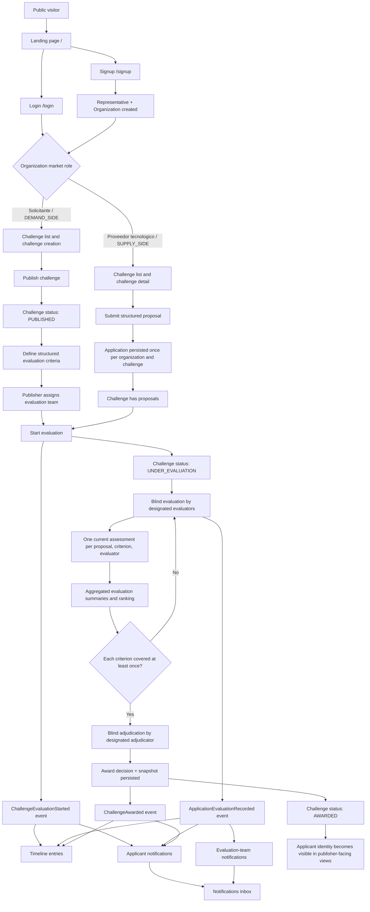
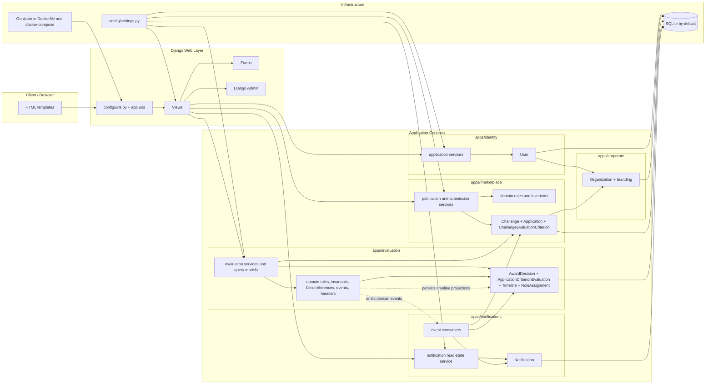

# VIMER Project Diagrams

This document illustrates the current implemented state of VIMER with:

- a functional flow diagram
- an architecture diagram

The diagrams are written in Mermaid so they can evolve together with the codebase.

## Functional Flow

## Architecture Diagram

## Notes

- `Marketplace` remains the physical Django app for both challenge and proposal concerns, but its internals are now separated explicitly across domain modules, application services, forms, views, and tests.
- `Evaluation` is the most event-driven context today: it emits the milestones consumed by challenge timeline projections and in-app notifications.
- The current scoring model supports multiple evaluators per criterion, with one current persisted assessment per `(proposal, criterion, evaluator)`.
- Blind evaluation is enforced in publisher-facing evaluation and adjudication flows until the challenge is awarded.
